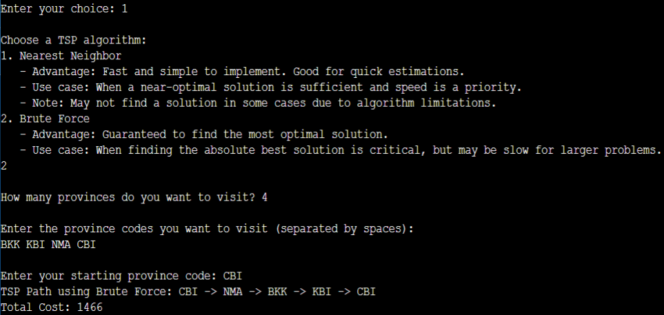

# 🗺️ Traveling Salesman Problem (TSP) Solver


> **"Finding the optimal route across 14 provinces in Thailand."**
> A C-based application that compares algorithms to solve the classic Traveling Salesman Problem for travel planning.

---

## 📄 Full Project Report
For the complete analysis, algorithm comparison, and complexity study ($O(n!)$ vs $O(n^2)$), please view the full report below:

### [👉 Click Here to Read the Full Report (PDF)](TSP_G12_report (1))
*(Note: Please click the link above to view the detailed documentation)*

---

## 🔍 Project Overview

### 🎯 Objective
To apply Data Structure concepts to solve real-world logistics problems. This project implements and compares two major algorithms to find the shortest path for visiting multiple provinces in Thailand (e.g., Bangkok, Chiang Mai, Phuket).

### ⚙️ Algorithms Implemented
1.  **Brute Force Algorithm:**
    * **Method:** Calculates *every possible permutation* of routes.
    * **Pros:** Guarantees the **absolute shortest path** (100% Accuracy).
    * **Cons:** Very slow for many cities ($O(n!)$ complexity).
2.  **Nearest Neighbor Algorithm:**
    * **Method:** Always chooses the closest unvisited city.
    * **Pros:** Very fast calculation.
    * **Cons:** May not find the optimal path (Greedy approach).

---

## 💻 How It Works (Demo)

The program allows users to select provinces, choose an algorithm, and visualize the route.


*(Example: Calculating optimal route using Brute Force Algorithm)*

### 🛠️ Key Features (Code Highlights)
* **Graph Representation:** Uses **Adjacency Matrix** and **Adjacency List** to store distances between provinces.
* **Dynamic Input:** Users can add new provinces and distances directly via the console.
* **Recursive Permutation:** Implements backtracking to generate all possible routes for Brute Force.

```c
// Sample: Structure used for the Graph
struct Graph {
  int numVertices;
  char provinceCodes[MAX_PROVINCES][MAX_CODE_LENGTH];
  long long adjMatrix[MAX_PROVINCES][MAX_PROVINCES]; // Adjacency Matrix
  struct node **adjLists; // Adjacency List
};
